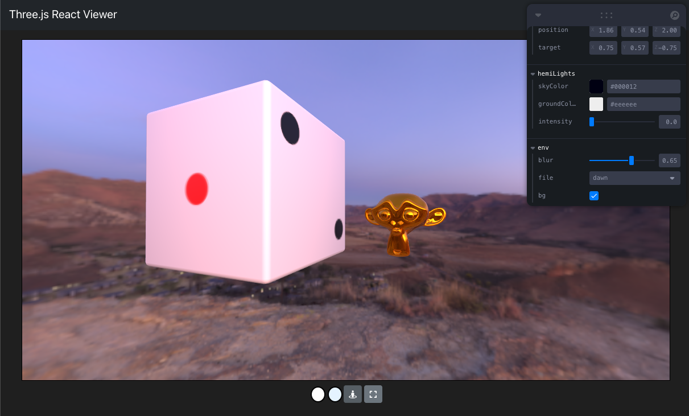

# react-three-fiber-sample

react(next.js), three.js, React Three Fiberを使ったglTFビュアーのサンプル

画面上で拡大縮小、ズームインズームアウト、カメラの移動ができます

右上のコントローラーを操作することでライトの調整や環境の変更などができます



## 開始方法

```bash
# パッケージのインストール
npm install

# 開発用サーバーを起動
npm run dev
```

[http://localhost:3000](http://localhost:3000) を開く
